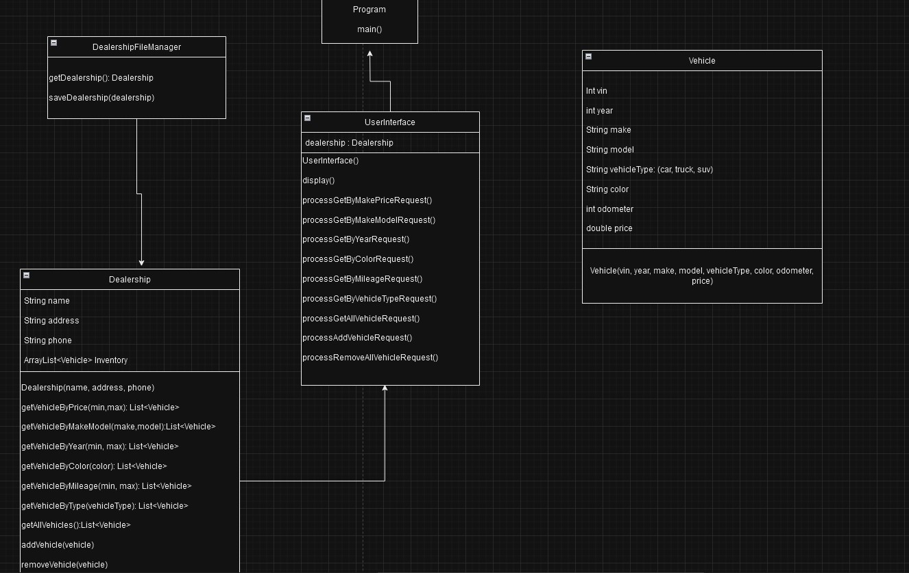
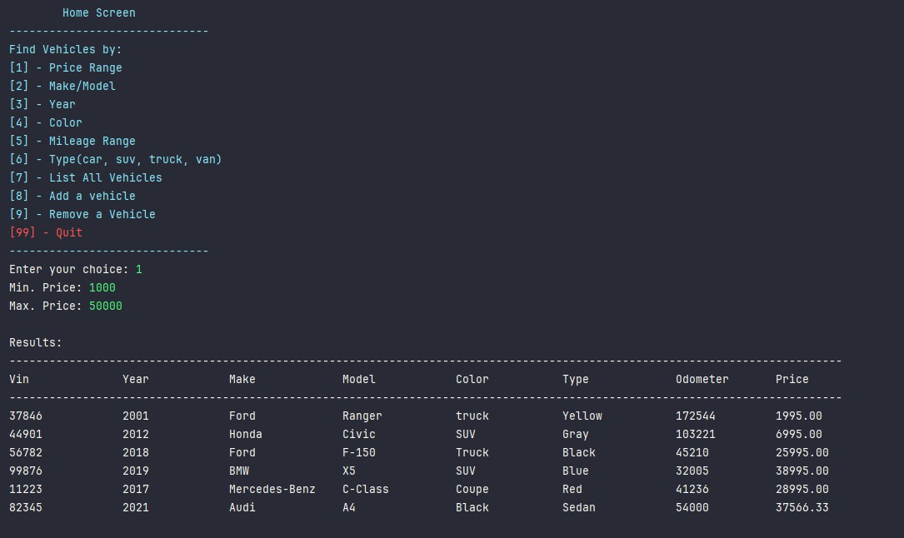
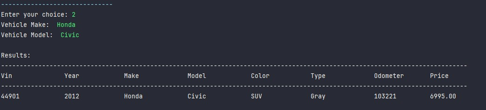
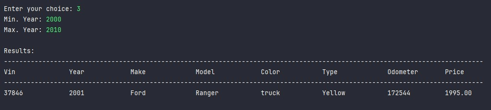
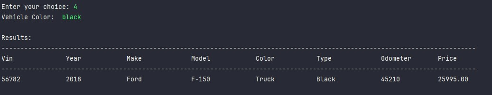
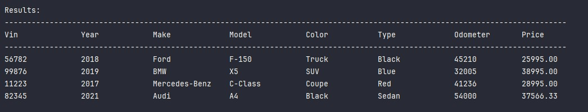
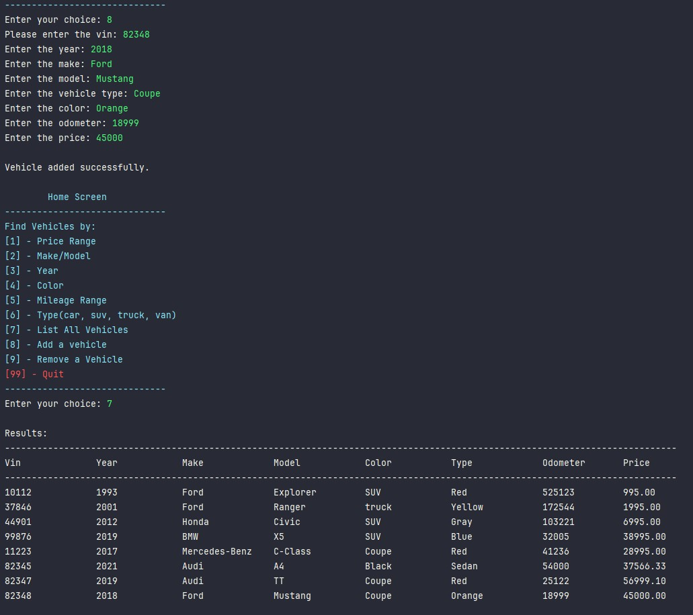
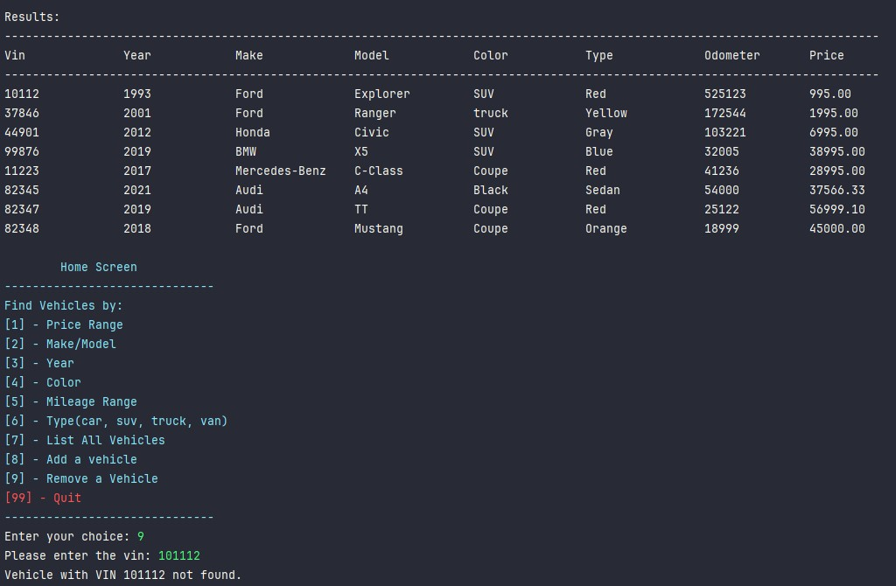
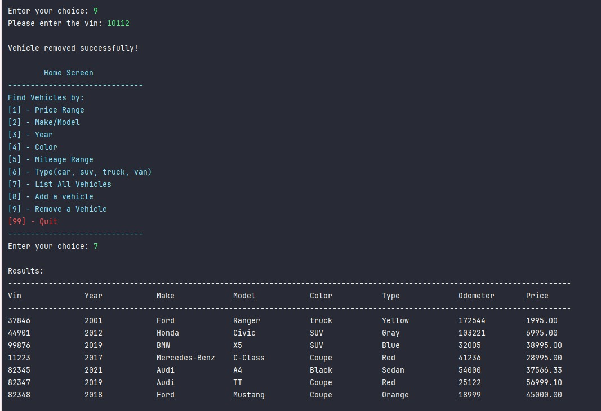

# car-dealership

### What is the Car Dealership program?
This Java application simulates a car dealership system where users can interactively search for vehicles based on various criteria, add new vehicles to the inventory, and remove existing ones. The system reads and saves data to a CSV file for persistence. 

## Process
> Beginning stages: an idea on how I wanted my display to function/look like




## Screenshots



















## Code 
> `Dealership` class is where it filters vehicles by certain criteria. 
```java
    
    public List<Vehicle> getVehicleByPrice(double min, double max){
        return inventory.stream()
                .filter(v-> v.getPrice() >= min && v.getPrice() <= max)
                .collect(Collectors.toList());
    }

    public List<Vehicle> getVehicleByMakeModel(String make, String model){
        return inventory.stream()
                .filter(v -> v.getMake().equalsIgnoreCase(make) && v.getModel().equalsIgnoreCase(model) )
                .collect(Collectors.toList());
    }

    public List<Vehicle> getVehicleByYear(double min, double max){
        return inventory.stream()
                .filter(v-> v.getYear() >= min && v.getYear() <= max)
                .collect(Collectors.toList());
    }

    public List<Vehicle> getVehicleByColor(String color){

        return inventory.stream()
                .filter(v -> v.getColor().equalsIgnoreCase(color))
                .collect(Collectors.toList());
    }

    public List<Vehicle> getVehicleByMileage(double min, double max){
        return inventory.stream()
                .filter(v-> v.getOdometer() >= min && v.getOdometer() <= max)
                .collect(Collectors.toList());
    }

    public List<Vehicle> getVehicleByType(String vehicleType){
        return inventory.stream()
                .filter(v -> v.getVehicleType().equalsIgnoreCase(vehicleType))
                .collect(Collectors.toList());
    }

   
```


>**Interest Piece:** one piece of interest that I really enjoyed coding was my getVehicle function. It just helped with readablitly and differentiating from the deaelership object. 
```java
private static Vehicle getVehicle(String line)
    {
        Scanner lineScanner = new Scanner(line);

        lineScanner.useDelimiter("\\|");

        int vin = lineScanner.nextInt();
        int year = lineScanner.nextInt();
        String make = lineScanner.next();
        String model = lineScanner.next();
        String vehicleType = lineScanner.next();
        String color = lineScanner.next();
        int odometer = lineScanner.nextInt();
        double price = lineScanner.nextDouble();

        Vehicle vehicleEntry = new Vehicle(vin, year, make, model, vehicleType, color, odometer, price);
        return vehicleEntry;
    }

```